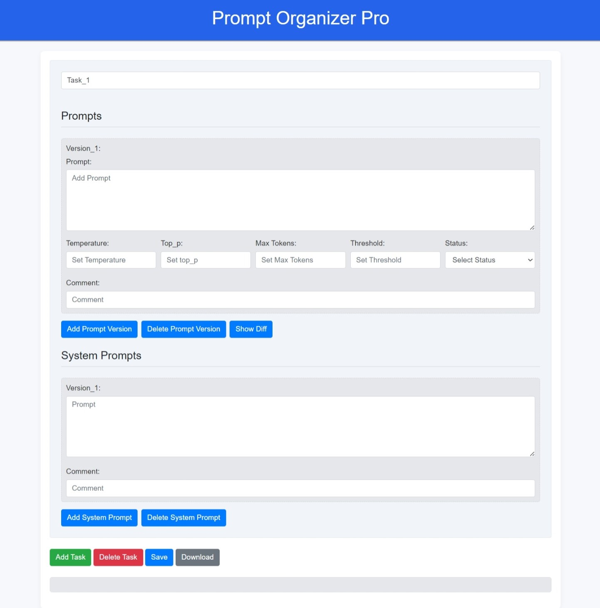

# Managing Prompts with Ease: Prompt Organizer Pro

In the realm of **Prompt Engineering**, managing multiple versions of prompts can become overwhelming. Individuals and teams often face challenges in tracking and organizing different types of prompts, leading to the possibility of missing out on some of the best ones.

The lack of a structured approach to manage prompts efficiently often makes it difficult to navigate through them, causing a significant impediment in the workflow. Understanding this persistent issue, we introduce an application that serves as a beacon of relief: The **Prompt Organizer Pro**.

## Features of the Prompt Organizer Pro:
1. Task-Based Organization:
Users can organize prompts under different tasks (Summarization, Topic Discovery, Intent identification etc), allowing for a clear and categorized view of each prompt.

2. Prompt Versions Management:
Within each task, users can create and manage multiple versions of prompts, each with its unique set of parameters.

3. Prompt Parameters Configuration:
Users can easily configure various parameters like temperature, top_p, max tokens, and threshold for each version of the prompt.

4. Status Tracking:
The app allows users to set and track the status of each prompt, aiding in prompt evaluation and optimization.

5. Commenting Feature:
Each prompt version has an associated comment box, allowing users to annotate important notes or information related to the prompt.

6. System Prompt Management:
Alongside user prompts, the app also enables the management of system prompts, each with its commenting feature.

7. Save and Download:
Users can save their progress and download the organized prompts in YAML format, facilitating easy sharing and storage.

  

